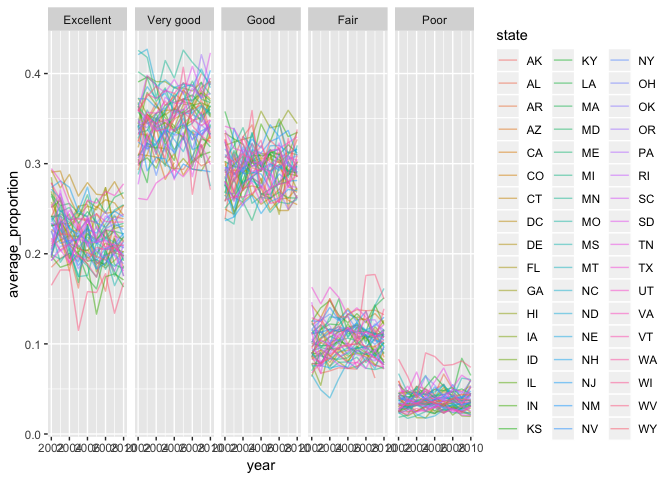

P85105\_hw3\_jw3597
================

#### Problem 1

This problem uses the BRFSS data. The data is loaded from the p8105.datasets package.

First we will do some data cleaning:

-   format the data to use appropriate variable names;
-   focus on the “Overall Health” topic
-   include only responses from “Excellent” to “Poor”
-   organize responses as a factor taking levels from “Excellent” to “Poor”

``` r
library(p8105.datasets)
data("brfss_smart2010")

# I am formatting the data using appropriate variable names, including only using responses from "Excellent" to "Poor", and then organizing the responses as a factor:
brfss_smart2010 = janitor::clean_names(brfss_smart2010) %>%
  rename(state = locationabbr, county = locationdesc, health_issue = class, health_issue_topic = topic, health_question = question, health_response = response, lower_95CI = confidence_limit_low, upper_95CI = confidence_limit_high) %>% 
  filter(health_response %in% c("Excellent", "Very good", "Good", "Fair", "Poor")) %>%
           mutate(health_response = factor(health_response, levels = c("Excellent", "Very good", "Good", "Fair", "Poor"))) %>%
  arrange(health_response)
```

Using this dataset, I will answer the following (commenting on the results of each):

-   In 2002, which states were observed at 7 locations?

``` r
brfss_2002 = brfss_smart2010 %>% 
  filter(year == "2002") %>%
  group_by(state) %>%
  summarize(n = n_distinct(county)) %>%
  filter(n == 7)
```

In 2002, the states observed at 7 locations are CT, FL, and NC.

-   Make a “spaghetti plot” that shows the number of observations in each state from 2002 to 2010.

``` r
gg2002_2010 = brfss_smart2010 %>%
  group_by(state, year) %>%
  distinct(county) %>%
  count(year,state)

ggplot(gg2002_2010, aes(x = year, y = n, color = state)) + geom_line(se = FALSE)
```

    ## Warning: Ignoring unknown parameters: se


-   Make a table showing, for the years 2002, 2006, and 2010, the mean and standard deviation of the proportion of “Excellent” responses across locations in NY State.

``` r
table1 = brfss_smart2010 %>%
  filter(state == "NY", health_response == "Excellent", year %in% c("2002", "2006", "2010")) %>%
  spread(key = health_response, value = data_value) %>%
  group_by(year) %>%
  summarize(mean_excellent = mean(Excellent/100), sd_excellent = sd(Excellent/100))
```

-   For each year and state, compute the average proportion in each response category (taking the average across locations in a state). Make a five-panel plot that shows, for each response category separately, the distribution of these state-level averages over time.

``` r
panel_plot = brfss_smart2010 %>%
  group_by(state, year, health_response) %>%
  summarize(average_proportion = mean(data_value/100))

ggplot(panel_plot, aes(x = year, y = average_proportion, color = state)) + 
  geom_line(alpha = 0.5) + 
  facet_grid(~health_response)
```

    ## Warning: Removed 1 rows containing missing values (geom_path).



#### Problem 2

This problem uses the Instacart data. The data is loaded from the p8105.datasets package (called instacart).

The goal is to do some exploration of this dataset. To that end, write a short description of the dataset, noting the size and structure of the data, describing some key variables, and giving illstrative examples of observations. Then, do or answer the following (commenting on the results of each):

-   How many aisles are there, and which aisles are the most items ordered from?
-   Make a plot that shows the number of items ordered in each aisle. Order aisles sensibly, and organize your plot so others can read it.
-   Make a table showing the most popular item aisles “baking ingredients”, “dog food care”, and “packaged vegetables fruits”
-   Make a table showing the mean hour of the day at which Pink Lady Apples and Coffee Ice Cream are ordered on each day of the week; format this table for human readers (i.e. produce a 2 x 7 table).

``` r
data("instacart")

# Identifying the number of aisles and aisles with the most ordered items
uni = distinct(instacart, aisle_id)
count(uni)
```

    ## # A tibble: 1 x 1
    ##       n
    ##   <int>
    ## 1   134

``` r
sort(table(instacart$aisle), decreasing = TRUE)
```

    ## 
    ##              fresh vegetables                  fresh fruits 
    ##                        150609                        150473 
    ##    packaged vegetables fruits                        yogurt 
    ##                         78493                         55240 
    ##               packaged cheese water seltzer sparkling water 
    ##                         41699                         36617 
    ##                          milk                chips pretzels 
    ##                         32644                         31269 
    ##               soy lactosefree                         bread 
    ##                         26240                         23635 
    ##                  refrigerated                 ice cream ice 
    ##                         23228                         22676 
    ##                frozen produce                          eggs 
    ##                         22453                         19875 
    ##                      crackers                  frozen meals 
    ##                         19592                         18221 
    ##           energy granola bars                    lunch meat 
    ##                         17449                         16957 
    ##                   soft drinks                        cereal 
    ##                         16279                         16201 
    ##                   fresh herbs          fresh dips tapenades 
    ##                         16052                         15142 
    ##           soup broth bouillon                 juice nectars 
    ##                         15109                         14350 
    ##              packaged produce             baby food formula 
    ##                         13460                         13198 
    ##            baking ingredients          other creams cheeses 
    ##                         13088                         12820 
    ##        hot dogs bacon sausage                   paper goods 
    ##                         12813                         12694 
    ##      canned jarred vegetables        nuts seeds dried fruit 
    ##                         12679                         12532 
    ##                         cream                       spreads 
    ##                         12356                         12102 
    ##            canned meals beans               candy chocolate 
    ##                         11774                         11453 
    ##                     dry pasta                 oils vinegars 
    ##                         11298                         10620 
    ##                        butter                 cookies cakes 
    ##                         10575                          9980 
    ##                 instant foods              breakfast bakery 
    ##                          9917                          9851 
    ##                    condiments                   pasta sauce 
    ##                          9743                          9736 
    ##              frozen breakfast                           tea 
    ##                          9729                          9376 
    ##             spices seasonings       frozen appetizers sides 
    ##                          9279                          8870 
    ##                        coffee          tortillas flat bread 
    ##                          8392                          8353 
    ##                       missing                  frozen pizza 
    ##                          8251                          7661 
    ##                   asian foods                 popcorn jerky 
    ##                          7007                          6917 
    ##        fruit vegetable snacks      hot cereal pancake mixes 
    ##                          6741                          6352 
    ##       grains rice dried goods             cleaning products 
    ##                          6134                          5894 
    ##              packaged poultry               poultry counter 
    ##                          5608                          5208 
    ##        preserved dips spreads        tofu meat alternatives 
    ##                          5188                          5123 
    ##                    buns rolls          pickled goods olives 
    ##                          5054                          4882 
    ##    doughs gelatins bake mixes          energy sports drinks 
    ##                          4758                          4742 
    ##       frozen vegan vegetarian       salad dressing toppings 
    ##                          4727                          4719 
    ##                       laundry                prepared meals 
    ##                          4636                          4133 
    ##       canned fruit applesauce             specialty cheeses 
    ##                          3996                          3873 
    ##               dish detergents                       granola 
    ##                          3870                          3803 
    ##                  latino foods           frozen meat seafood 
    ##                          3548                          3341 
    ##           canned meat seafood                  meat counter 
    ##                          3241                          3159 
    ##       breakfast bars pastries                  oral hygiene 
    ##                          3144                          3070 
    ##         prepared soups salads                  food storage 
    ##                          2936                          2906 
    ##    marinades meat preparation                 cat food care 
    ##                          2905                          2885 
    ##         honeys syrups nectars                          soap 
    ##                          2864                          2773 
    ##             body lotions soap          vitamins supplements 
    ##                          2137                          1969 
    ##    plates bowls cups flatware                 beers coolers 
    ##                          1959                          1839 
    ##                         other refrigerated pudding desserts 
    ##                          1795                          1729 
    ##                   fresh pasta             trash bags liners 
    ##                          1628                          1621 
    ##                 dog food care     protein meal replacements 
    ##                          1612                          1612 
    ##          frozen breads doughs                 packaged meat 
    ##                          1532                          1526 
    ##               bakery desserts                     hair care 
    ##                          1501                          1469 
    ##           trail mix snack mix              cold flu allergy 
    ##                          1463                          1346 
    ##                     red wines                     digestion 
    ##                          1243                          1205 
    ##                 diapers wipes         baking supplies decor 
    ##                          1109                          1094 
    ##                   white wines               seafood counter 
    ##                          1088                          1084 
    ##        air fresheners candles             cocoa drink mixes 
    ##                          1067                          1062 
    ##                 feminine care                       spirits 
    ##                          1048                           967 
    ##                      mint gum                frozen dessert 
    ##                           962                           922 
    ##              packaged seafood    muscles joints pain relief 
    ##                           909                           897 
    ##                more household                    deodorants 
    ##                           891                           858 
    ##                   facial care  bulk dried fruits vegetables 
    ##                           746                           725 
    ##                  indian foods  bulk grains rice dried goods 
    ##                           719                           634 
    ##                  kosher foods                  eye ear care 
    ##                           628                           548 
    ##                     first aid                     skin care 
    ##                           539                           534 
    ##                   shave needs            ice cream toppings 
    ##                           532                           504 
    ##    specialty wines champagnes              kitchen supplies 
    ##                           461                           448 
    ##           baby bath body care              baby accessories 
    ##                           328                           306 
    ##                  frozen juice                        beauty 
    ##                           294                           287

"Instacart" is a dataset that shows the online grocery orders of its users, containing 1,384,617 rows and 15 columns. Some of the key variables are the product name, aisle name and number where the product is found/categorized in, whether the item(s) were reordered, and the order ID that indicates the specific order placed by a customer.

-   There are 134 aisles and the aisles with the most ordered items is aisle 83 "fresh vegetables" (most), 24 "fresh fruits", and 123 "packaged vegetable fruits".

``` r
# Plot that shows the number of items ordered in each aisle. Aisles will be ordered sensibly and the plot will be organized to be readable to others

items = instacart %>%
  group_by(aisle, aisle_id) %>% 
  count(aisle) %>% 
  rename(items_ordered = n) %>%
  arrange(aisle)

ggplot(items, aes(x = aisle_id, y = items_ordered)) + 
  geom_point(alpha = .5)
```


``` r
# Table showing the most popular item aisles “baking ingredients”, “dog food care”, and “packaged vegetables fruits
```

``` r
# Table showing the mean hour of the day at which Pink Lady Apples and Coffee Ice Cream are ordered on each day of the week; format this table for human readers (i.e. produce a 2 x 7 table)
```

#### Problem 3

This problem uses the NY NOAA data. The data is loaded from the p8105.datasets package.

The goal is to do some exploration of this dataset. To that end, write a short description of the dataset, noting the size and structure of the data, describing some key variables, and indicating the extent to which missing data is an issue. Then, do or answer the following (commenting on the results of each):

-   Do some data cleaning. Create separate variables for year, month, and day. Ensure observations for temperature, precipitation, and snowfall are given in reasonable units. For snowfall, what are the most commonly observed values? Why?
-   Make a two-panel plot showing the average temperature in January and in July in each station across years. Is there any observable / interpretable structure? Any outliers?
-   Make a two-panel plot showing (i) tmax vs tmin for the full dataset (note that a scatterplot may not be the best option); and (ii) make a plot showing the distribution of snowfall values greater than 0 and less than 100 separately by year.

``` r
data("ny_noaa")
```
